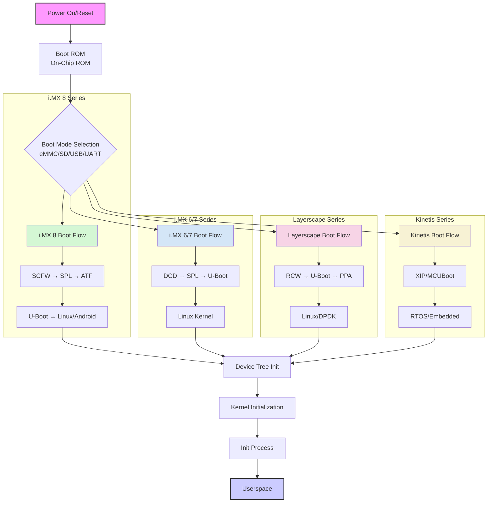
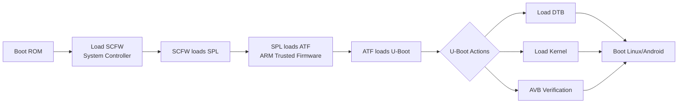
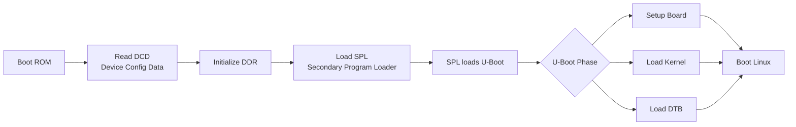
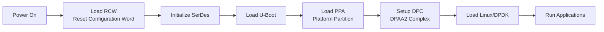
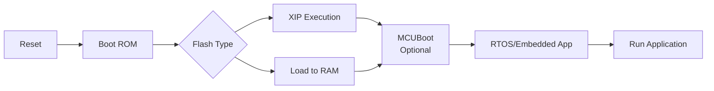

# Boot Process


## Overview
This document details the boot process for NXP ARM-based development boards running Linux and Android operating systems. The boot sequence follows a multi-stage architecture from power-on to full OS initialization.

## Boot Process Architecture



## Board-Specific Boot Flows

### 1. **i.MX 8 Series (i.MX 8M/8M Mini/8M Plus/8QM)**


**Key Components:**
- **SCFW**: System Controller Firmware (manages power, clocks, security)
- **ATF**: ARM Trusted Firmware (EL3 secure monitor)
- **OPTEE**: Optional TEE for secure applications
- **AVB**: Android Verified Boot (for Android images)

**Typical Boards:** i.MX 8M EVK, i.MX 8M Mini EVK, i.MX 8M Plus EVK

### 2. **i.MX 6/7 Series (i.MX 6Quad/6Dual/6Solo/7Dual)**


**Key Components:**
- **DCD**: Device Configuration Data (DDR timing parameters)
- **IVT**: Image Vector Table (image header structure)
- **HAB**: High Assurance Boot (security enforcement)

**Typical Boards:** Sabre SD, Sabre AI, i.MX 7Dual SABRE

### 3. **Layerscape Series (LX2160A, LS1046A, LS1028A)**


**Key Components:**
- **RCW**: Reset Configuration Word (pin multiplexing, SerDes config)
- **PPA**: Platform Partition Architecture (firmware partition)
- **DPAA2**: Data Path Acceleration Architecture

**Typical Boards:** Layerscape LX2160ARDB, LS1046ARDB, LS1028ARDB

### 4. **Kinetis Series (K64, K66, K28)**


**Key Components:**
- **XIP**: Execute-In-Place (run directly from flash)
- **MCUBoot**: Secure bootloader for MCUs
- **FlexSPI**: External flash interface

**Typical Boards:** FRDM-K64F, FRDM-K66F, TWR-K28F

## Common Boot Components

### Boot Media Options
| Media Type | Typical Use | Speed | Capacity |
|------------|-------------|-------|----------|
| eMMC | Primary storage | High | 4GB-64GB |
| SD Card | Development | Medium | Up to 512GB |
| QSPI Flash | Boot device | Medium | 16MB-256MB |
| NAND Flash | Cost-sensitive | Medium | 256MB-2GB |
| USB | Recovery/Download | Variable | N/A |

### Security Features
- **HAB** (High Assurance Boot): Code signing and verification
- **CAAM** (Cryptographic Accelerator): Hardware crypto engine
- **TrustZone**: ARM security extension
- **AVB 2.0**: Android Verified Boot
- **Secure JTAG**: Debug port protection

### Boot Configuration
```bash
# Typical U-Boot environment variables
bootcmd=mmc dev ${mmcdev}; mmc read ${loadaddr} ${kernel_addr} ${kernel_size}; \
        mmc read ${fdt_addr} ${fdt_addr_r} ${fdt_size}; \
        bootz ${loadaddr} - ${fdt_addr}

bootargs=console=ttymxc0,115200 root=/dev/mmcblk1p2 rootwait rw
```

## Quick Reference

### Boot Mode Selection
| Boot Pins | Mode | Description |
|-----------|------|-------------|
| 0000 | Serial Downloader | USB/UART recovery |
| 0001 | Internal Boot | Normal boot from flash |
| 0010 | USB Boot | Boot from USB device |
| 0100 | SD Card | Boot from SD/MMC |

### Common Commands
```bash
# U-Boot commands for i.MX
=> mmc list          # List MMC devices
=> fatls mmc 0:1     # List files on FAT partition
=> boot              # Boot with default settings
=> run netboot       # Network boot
=> fastboot          # Enter fastboot mode
```

## Troubleshooting

### Common Issues
1. **Boot hangs at SPL**: Check DDR initialization parameters
2. **HAB authentication fails**: Verify image signing
3. **Kernel panic early**: Check device tree compatibility
4. **No boot media detected**: Verify boot mode pins

### Debug Tools
- **UUU (Universal Update Utility)**: Flashing and recovery
- **OpenOCD**: JTAG debugging
- **U-Boot console**: Serial debug at 115200 baud
- **Linux dmesg**: Kernel boot messages

## Resources
- [NXP Official Documentation](https://www.nxp.com)
- [i.MX Linux Reference Manual](https://www.nxp.com/docs/en/user-guide/IMX_LINUX_USERS_GUIDE.pdf)
- [U-Boot Documentation](https://www.denx.de/wiki/U-Boot/Documentation)
- [ARM Trusted Firmware](https://trustedfirmware.org/)

## License
This documentation is provided for reference purposes. Refer to NXP official documentation for production use.

---
*Last Updated: *  
*For NXP i.MX, Layerscape, and Kinetis Platforms*
